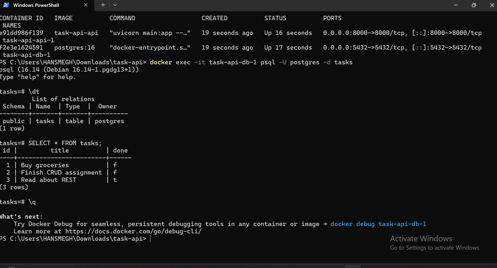

# Task API — CRUD + PostgreSQL + Docker

A REST API for managing a to-do list, built with **Python + FastAPI**, backed by **PostgreSQL** and containerized with **Docker**.

The API provides CRUD operations for tasks, persistent database storage, task filtering, searching, statistics, and database management through Docker Compose.

## What Changed

The project originally used SQLite for persistent storage. It has now been upgraded to **PostgreSQL 16 running inside Docker**.

The API endpoints remain unchanged. The main change is the storage layer and infrastructure.

## Why PostgreSQL + Docker

### PostgreSQL

- Reliable relational database
- Supports structured SQL queries
- Provides persistent data storage
- Suitable for applications that need a dedicated database
- Separates application logic from database storage

### Docker

- Provides a consistent development environment
- Runs PostgreSQL without requiring a manual local PostgreSQL installation
- Keeps the application and database isolated in containers
- Makes the complete application stack easy to start and reproduce
- Allows the API and database to communicate through Docker Compose networking

## How to Run

Make sure **Docker Desktop** is installed and running.

From the project directory, run:

```bash
docker compose up
```

Docker Compose starts:

- FastAPI application
- PostgreSQL 16 database

The API will be available at:

`http://localhost:8000`

Swagger API documentation:

`http://localhost:8000/docs`

## Environment Variables

Database configuration is managed using environment variables.

The project uses `.env` for local configuration and `.env.example` as a template.

Example:

```env
POSTGRES_USER=postgres
POSTGRES_PASSWORD=your_password
POSTGRES_DB=tasks
DATABASE_URL=postgresql://postgres:your_password@db:5432/tasks
```

Do not commit a real `.env` file containing passwords or other secrets to GitHub.

## API Endpoints

| Method | Path | Description |
|---|---|---|
| GET | `/` | API information |
| GET | `/health` | Health check |
| GET | `/tasks` | List all tasks |
| GET | `/tasks/{task_id}` | Get a specific task |
| POST | `/tasks` | Create a task |
| PUT | `/tasks/{task_id}` | Update a task |
| DELETE | `/tasks/{task_id}` | Delete a task |
| GET | `/stats` | Get task statistics |
| POST | `/reset` | Reset task data |

## CRUD Operations

The API supports:

- **Create** — `POST /tasks`
- **Read** — `GET /tasks` and `GET /tasks/{task_id}`
- **Update** — `PUT /tasks/{task_id}`
- **Delete** — `DELETE /tasks/{task_id}`

## PostgreSQL Database

PostgreSQL 16 runs in its own Docker container.

The database name is:

`tasks`

The PostgreSQL service is configured in:

`docker-compose.yml`

The API connects to PostgreSQL through the Docker Compose service name:

`db`

This allows the FastAPI application container and PostgreSQL container to communicate over the Docker network.

## Database Verification

The PostgreSQL database can be inspected directly from the running database container.

Run:

```bash
docker exec -it task-api-db-1 psql -U postgres -d tasks -c "SELECT * FROM tasks;"
```

This verifies that task data is stored in PostgreSQL.

## PostgreSQL Database Screenshot

Take a screenshot of the database command output and save it in the project folder as:

`postgres_screenshot.png`

Then add it to this README:



## API Verification

The API was tested after moving to PostgreSQL.

The following operations were verified:

- Creating tasks
- Reading tasks
- Updating tasks
- Deleting tasks
- Checking task statistics
- Resetting task data
- Checking API health

The API endpoints continue to work while PostgreSQL provides persistent storage.

## Docker Compose Commands

### Start the application

```bash
docker compose up
```

### Start and rebuild the application

```bash
docker compose up --build
```

### Stop the application

```bash
docker compose down
```

### Stop the application and remove database volumes

```bash
docker compose down -v
```

## Project Structure

```text
task-api/
├── main.py
├── Dockerfile
├── docker-compose.yml
├── requirements.txt
├── .env.example
├── .gitignore
├── README.md
└── postgres_screenshot.png
```

## Tech Stack

- Python 3
- FastAPI
- Uvicorn
- PostgreSQL 16
- Docker
- Docker Compose

## Database Persistence

PostgreSQL provides persistent storage for the application.

The FastAPI application and PostgreSQL database run as separate Docker containers.

Docker Compose manages the connection between the application and database.

The configured database volume allows PostgreSQL data to persist between container restarts.

## Final Verification

The complete application stack was successfully tested using Docker Compose.

Start the application with:

```bash
docker compose up
```

The FastAPI application connects successfully to PostgreSQL, and the CRUD API operates against the PostgreSQL database.

Swagger documentation:

`http://localhost:8000/docs`

## Conclusion

The Task API has been upgraded from a local SQLite-based implementation to a **PostgreSQL database running with Docker**.

The API interface remains consistent while the database infrastructure now provides a containerized and persistent backend environment.