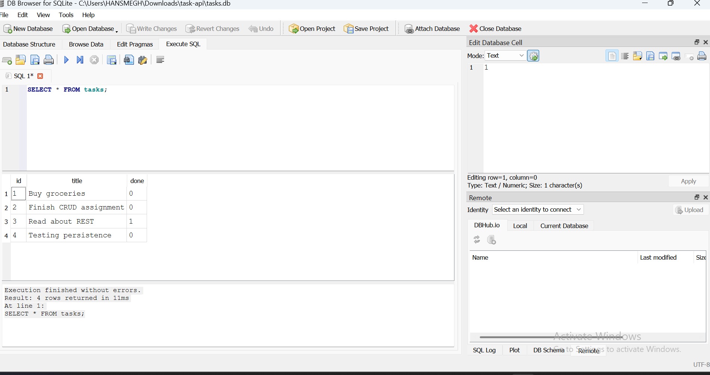

# Task API — CRUD + SQLite (Backend AI Engineering, Week 3)

A REST API for managing a to-do list, built with **Python + FastAPI**, now backed by a real **SQLite database** instead of in-memory storage. Same endpoints as Assignment 1 — but your data now survives a server restart.

## What changed since Assignment 1

Only the **storage layer**. Every endpoint, request shape, and response shape is identical to Assignment 1 — the API is the promise, the database is where that promise is kept. Restarting the server used to wipe all tasks; now it doesn't.

## Why SQLite

- **Single file, zero setup** — no separate database server to install or run, no accounts, no config
- **Free and built into Python** — the `sqlite3` module ships with Python itself, nothing extra to install
- **Perfect for a project this size** — a to-do list doesn't need a heavyweight database server; SQLite handles this scale easily and is a real, production-used database (not a toy)

## Where the database file lives

`tasks.db`, created automatically in the project's root folder the first time the app runs. It's a single file — delete it and restart the app to get a completely fresh database with the 3 seeded tasks again.

## How to install & run

```bash
# 1. Install dependencies (same as Assignment 1, no new packages needed —
#    sqlite3 is part of Python's standard library)
pip install fastapi uvicorn

# 2. Run the server
python3 -m uvicorn main:app --reload
```

The server starts on **http://localhost:8000**. Open **http://localhost:8000/docs** for Swagger UI.

On first run, `tasks.db` is created automatically, the `tasks` table is created, and 3 example tasks are seeded. Restarting the server does **not** duplicate the seed — it only happens when the table is genuinely empty.

## Endpoints

Identical to Assignment 1 — same paths, same methods, same status codes:

| Method | Path | Description | Success | Errors |
|---|---|---|---|---|
| GET | `/` | API info | 200 | — |
| GET | `/health` | Health check | 200 | — |
| GET | `/tasks` | List tasks (supports `?done=true` and `?search=word`) | 200 | — |
| GET | `/tasks/{id}` | Get one task | 200 | 404 if not found |
| POST | `/tasks` | Create a task (`{"title": "..."}`) | 201 | 400 if title missing/empty |
| PUT | `/tasks/{id}` | Update a task | 200 | 404 if not found, 400 if title empty |
| DELETE | `/tasks/{id}` | Delete a task | 204 | 404 if not found |
| GET | `/stats` | Task counts, computed with SQL `COUNT(*)` | 200 | — |
| POST | `/reset` | Wipe and re-seed the database | 200 | — |

## Proof the API didn't change

I re-ran the exact same curl commands from Assignment 1 against this SQLite-backed version, and every response matched — same status codes, same JSON shapes:

```bash
curl -i -X POST http://localhost:8000/tasks -H "Content-Type: application/json" -d '{"title":"Buy milk"}'
# HTTP/1.1 201 Created
# {"id":4,"title":"Buy milk","done":false}

curl -i -X POST http://localhost:8000/tasks -H "Content-Type: application/json" -d '{}'
# HTTP/1.1 400 Bad Request
# {"detail":"title is required and cannot be empty"}
```

Identical tests passing against a completely different storage backend is exactly the proof that storage is "just an implementation detail" — nothing about *what the API does* changed, only *where it keeps the data*.

## Proof of persistence (the actual point of this assignment)

1. Started the server
2. Created a task: `POST /tasks {"title": "Buy milk"}` → got back `{"id": 4, ...}`
3. **Killed the server completely**
4. Restarted it fresh
5. Ran `GET /tasks` — **"Buy milk" was still there**, id 4 intact

This is the first version of this project where that's true. Assignment 1's in-memory list would have lost it completely on restart.

## Stage 4 — SQL by hand

Opened `tasks.db` in DB Browser for SQLite and ran queries directly against the same file the API reads from. One example:

```sql
UPDATE tasks SET done = 1;
```

This marks every task as completed. Running `GET /tasks` through the API immediately afterward reflects the change — no restart, no syncing step. The API and DB Browser are reading the exact same file; there's only one source of truth.



## Parameterized queries — kept safe throughout

Every query that includes user input uses a `?` placeholder, never string concatenation:

```python
conn.execute("SELECT * FROM tasks WHERE id = ?", (task_id,))
```

This is what prevents SQL injection — the database driver handles escaping the value safely, rather than trusting raw user input glued into a SQL string.

## Extras I added (stretch goals)

- **Search with SQL**: `GET /tasks?search=milk` using `LIKE`
- **Filter with SQL**: `GET /tasks?done=true` using a `WHERE` clause
- **Sort alphabetically**: results always come back `ORDER BY title`
- **Real statistics**: `GET /stats` computed with SQL's `COUNT(*)`, not counted in Python

## Tech

Python 3, FastAPI, Uvicorn, `sqlite3` (Python standard library) — no external database driver, no server to run separately.
